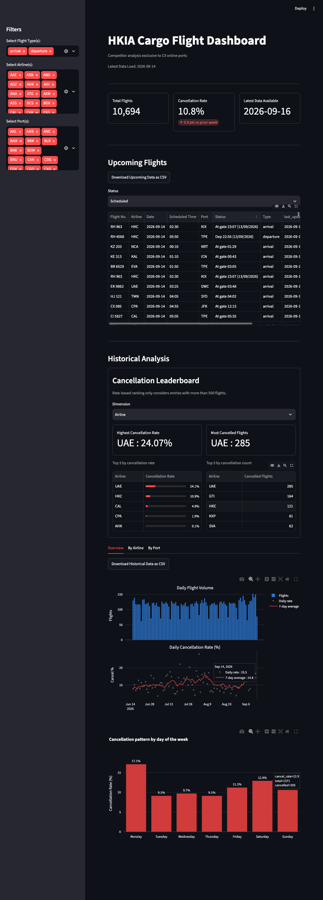

# HKIA Data & Dashboard

A real-time flight monitoring and data pipeline tool that fetches flight information from the **Hong Kong International Airport (HKIA) public flight API**, tracks status changes (cancellations) over time, and visualizes the accumulated history using a **Streamlit** dashboard.

---

## 📂 Project Structure

```text
HKIA_flight_monitor/
├── __init__.py
├── back_logs/                  # stdout/stderr + run logs from scripts/backfill.sh
├── data/                       # "live" working files, overwritten on every run
│   ├── changed_flights.csv         # latest snapshot, delayed/cancelled rows only
│   ├── current_flights.csv         # latest full snapshot (all flights, one run)
│   ├── HKIA_merged.csv             # append-only historical archive (source of truth for the dashboard)
│   ├── HKIA_upcoming.csv           # append-only staging area for future-dated flights
│   ├── newly_changed_flights.csv   # rows that changed to delayed/cancelled *this run only*
│   └── online_ports.csv            # allow-list of ports served by CX ("online" = codeshare/operated)
├── past_data/                  # one current_flights_*.csv and changed_flights_*.csv per calendar day
├── logs/                       # output of scripts/run_with_log.sh
├── requirements.txt
├── scripts/
│   ├── backfill.sh              # historical backfill over a date range, cargo flights only
│   ├── dailyfetch.sh            # resets HKIA_upcoming.csv and re-fetches a rolling D-1..D+2 window
│   └── run_with_log.sh          # wraps a single `src/main.py` run with a timestamped log file (for cron)
└── src/
    ├── __init__.py
    ├── api_client.py            # HTTP call to the HKIA API + JSON flattening
    ├── config.py                 # .env loader / environment variable defaults
    ├── csv_analysis.py           # ad-hoc, standalone scratch script (not part of the pipeline)
    ├── data_processor.py         # diffs current flights against the last snapshot
    ├── file_manager.py           # all CSV read/write/append logic
    ├── main.py                   # CLI entry point that wires the pipeline together
    ├── visuals.py                 # Streamlit dashboard (dark theme, original)

```

---

## 📷 Dashboard Preview


---

## 🧠 Concepts

- **"Cargo" and "arrival"** are boolean-style flags (passed as the strings `'true'`/`'false'`) that mirror the HKIA API's own query parameters. `cargo=true` restricts results to cargo flights; `arrival=true` fetches arrivals instead of departures.
- **"Online ports"** (`data/online_ports.csv`) is a manually curated allow-list of airport codes. The dashboards inner-join on this list so all charts only ever reflect ports that Cathay Pacific ("CX") itself serves — i.e. competitor-analysis is scoped to routes CX actually competes on.
- **Snapshot vs. history**: every pipeline run captures a *snapshot* of "what does the API say right now." `file_manager.py` compares each new snapshot to the previous one to detect flights that flipped to `delayed`/`cancelled`, and separately appends every snapshot's rows to a permanent history file (`HKIA_merged.csv` or `HKIA_upcoming.csv`) so trends can be analyzed later.
- **Past vs. upcoming data are stored differently.** Flights for `target_date < today` are treated as settled history and appended to `data/HKIA_merged.csv` (permanent, grows forever). Flights for `target_date >= today` are considered provisional (status can still change) and are appended to `data/HKIA_upcoming.csv`, which `scripts/dailyfetch.sh` wipes and rebuilds daily — so "upcoming" data is never a permanent record, only a rolling forecast window.

---

## 🔄 Data Flow

```text
                     ┌─────────────────────┐
                     │  HKIA public API    │
                     │ hongkongairport.com │
                     └──────────┬──────────┘
                                │ GET /flightinfo-rest/rest/flights
                                │ ?date&span=1&cargo&arrival
                                ▼
                     ┌─────────────────────┐
                     │  api_client.py      │  flattens nested JSON →
                     │  fetch_flights()    │  list[dict] (one row per flight)
                     └──────────┬──────────┘
                                ▼
                     ┌─────────────────────┐      reads previous run via
                     │ data_processor.py   │◄─────  file_manager.load_previous_snapshot()
                     │ process_flights()   │        (data/current_flights.csv)
                     └──────────┬──────────┘
                                │ (full_df, changes[])
                                ▼
        ┌───────────────────────┴────────────────────────┐
        ▼                       ▼                          ▼
 write_current_snapshot   write_changed_snapshot      append_changes
 → data/current_flights   → data/changed_flights       → data/newly_changed_flights
 → past_data/current_..   → past_data/changed_..        (overwritten every run)
   _{date}.csv               _{date}.csv
        │
        ▼
 append_to_csv (target_date < today  → data/HKIA_merged.csv    "settled" history, append-only)
              (target_date >= today  → data/HKIA_upcoming.csv  "forecast" window, rebuilt daily)
                                │
                                ▼
                     ┌─────────────────────┐
                     │ visuals.py /        │  streamlit run — reads HKIA_merged.csv
                     │                     │  (+ HKIA_upcoming.csv) and online_ports.csv
                     └─────────────────────┘
```

---

## 📄 Module Reference

### `src/api_client.py`
`fetch_flights(target_date, cargo, arrival)` — calls `GET https://hongkongairport.com/flightinfo-rest/rest/flights` with query params `span=1`, `date`, `lang=en`, `cargo`, `arrival`. On a non-2xx response it logs the error and returns `[]` rather than raising, so a failed fetch degrades to "no flights" instead of crashing the pipeline.

The API returns nested JSON (a list of day-objects, each containing a `list` of time-slots, each containing a `flight` list). This function flattens that structure into one flat dict per physical flight, with fields:

- `flight_id` — `"{flight_no}_{date}"`, a synthetic composite key used everywhere downstream to identify a unique flight instance.
- `flight_no`, `airline`, `date`, `time`
- `port` — comma-joined list of origin airports (arrivals) or destination airports (departures); a flight can list multiple ports for a multi-leg service.
- `status`, `status_code` — free-text status string (e.g. `"Cancelled"`, `"Est at 03:20 (16/09/2026)"`) and an optional numeric code.
- `flight_type` — `"arrival"` or `"departure"`, derived from the `arrival` flag.
- `last_updated` — timestamp the API itself last refreshed this day's data.

Which JSON key holds the "port" (`origin` vs `destination`) is chosen dynamically based on the `arrival` flag, since the API's own schema differs between arrivals and departures.

### `src/data_processor.py`
`process_flights(current_flights)` — takes the flat list from `api_client` and:
1. Converts it to a DataFrame (`full_df`).
2. Loads the *previous* run's status per `flight_id` via `file_manager.load_previous_snapshot()`.
3. For every current row whose status is `delayed` or `cancelled`, checks whether it was **not already** `delayed`/`cancelled` in the previous snapshot. If so, it's a newly-changed flight and gets appended to `changes`.

Returns `(full_df, changes)`. If no flights were passed in (e.g. the API call failed), returns an empty DataFrame and empty list instead of raising.

Note: comparison is snapshot-to-snapshot (this run vs. the last time `main.py` ran), not against the flight's original scheduled status — so the granularity of "newly changed" depends entirely on how often the pipeline is scheduled to run.

### `src/file_manager.py`
All CSV I/O for the pipeline lives here:

- `load_previous_snapshot()` — reads `CURRENT_FILE` and returns a `{flight_id: status}` dict. Returns `{}` (treated as "first run") if the file is empty, missing required columns, or fails to parse.
- `write_current_snapshot(flights_df, target_date)` — writes the full snapshot to both `past_data/current_flights_{date}.csv` (dated, kept forever) and `CURRENT_FILE` (overwritten, used as "previous snapshot" next run). No-ops with a warning if the DataFrame is empty. Also pretty-prints the full table to the console.
- `write_changed_snapshot(flights_df, target_date)` — same pattern, but filtered to `status` in `{delayed, cancelled}` (case-insensitive), written to `past_data/changed_flights_{date}.csv` and `CHANGED_FILE`.
- `append_changes(new_change_records)` — **overwrites** `NEWLY_CHANGED_FILE` with exactly this run's newly-changed flights (no history retained in this file — by design, it represents "what just changed").
- `append_to_csv(new_data, csv_file=".../data/HKIA_merged.csv")` — appends rows to a permanent CSV, writing the header only if the target file is currently empty. This is the function that builds up the long-term historical archive the dashboards read from. `main.py` overrides the default path to `HKIA_upcoming.csv` for future-dated runs.


> ⚠️ There is also no duplicate-detection on `append_to_csv` — re-running `main.py` for a date that's already been appended to `HKIA_merged.csv` will duplicate rows. The backfill script avoids this by only ever running once per date/flag combination in a given invocation.

### `src/main.py`
The CLI entry point and pipeline orchestrator. `run(target_date, cargo, arrival)`:
1. Calls `fetch_flights()`.
2. Calls `process_flights()` to get the full snapshot + newly-changed rows.
3. Writes the current and changed snapshots (`write_current_snapshot`, `write_changed_snapshot`).
4. Writes newly-changed rows (`append_changes`).
5. Appends the full snapshot to the appropriate historical archive — `HKIA_merged.csv` if `target_date` is in the past, otherwise `HKIA_upcoming.csv`.

**CLI flags** (via `argparse`):

| Flag | Values | Default | Meaning |
|---|---|---|---|
| `--date` | `YYYY-MM-DD` | today | Which date to query the API for. |
| `--cargo` | `true` / `false` | `true` (only when calling `run()` directly; via CLI, unset unless passed) | Cargo vs. passenger flights. |
| `--arrival` | `true` / `false` | `false` | Arrivals vs. departures. |

Run it as a module so the `src.*` package-relative imports resolve correctly:
```bash
python -m src.main --date 2026-09-01 --cargo true --arrival false
```

### `src/visuals.py` 

- **Sidebar filters**: multiselects for flight type, airline, and port; all charts below react to the current filter selection. The app calls `st.stop()` if the filtered result is empty.
- **KPI row**: total flights, overall cancellation rate (with a week-over-week delta computed by comparing the trailing two 7-day windows of *past* data), and the most recent date present in the data.
- **Cancellation leaderboard**: top 5 airlines/ports by cancellation rate (restricted to entries with a minimum sample size — 200 in `visuals.py`, 100 in `visuals2.py`, to avoid low-volume outliers dominating the rate-based ranking) and by absolute cancelled count, toggled via a dimension selector.
- **Overview tab**: a two-row subplot (daily flight volume + daily cancellation rate with a 7-day rolling average line), plus a bar chart of cancellation rate by day of week.
- **By Airline / By Port tabs**: grouped bar charts of flight volume split by cancelled/flown, sorted by non-cancelled volume, with a range slider. The "By Port" tab also renders a treemap of flight volume colored by cancellation rate.
- **Upcoming**: a filterable/downloadable table of future-dated flights (from `HKIA_upcoming.csv` in `visuals.py`, or the merged frame's future rows in `visuals2.py`).
- All historical/upcoming tables are downloadable as CSV via `st.download_button`.

Run with:
```bash
streamlit run src/visuals.py
```

---

## 🗄️ Data Files

| File | Written by | Lifecycle | Notes |
|---|---|---|---|
| `data/current_flights.csv` | `write_current_snapshot` | Overwritten every run | Latest full snapshot; also the "previous snapshot" baseline for the next run's diff. |
| `data/changed_flights.csv` | `write_changed_snapshot` | Overwritten every run | Latest snapshot, filtered to delayed/cancelled. |
| `data/newly_changed_flights.csv` | `append_changes` | Overwritten every run | Only rows that *changed to* delayed/cancelled since the last run. |
| `data/HKIA_merged.csv` | `append_to_csv` | Append-only, forever | Historical archive for past-dated runs; primary data source for the dashboards. |
| `data/HKIA_upcoming.csv` | `append_to_csv` (override path) | Append-only, but wiped daily by `scripts/dailyfetch.sh` | Rolling forecast window for future-dated runs. |
| `data/online_ports.csv` | manually curated | Static | Single `ports` column; allow-list of CX-served airport codes used to scope the dashboards. |
| `past_data/current_flights_{date}.csv` | `write_current_snapshot` | One file per calendar date, kept forever | Dated full-snapshot archive, independent of `HKIA_merged.csv`. |
| `past_data/changed_flights_{date}.csv` | `write_changed_snapshot` | One file per calendar date, kept forever | Dated delayed/cancelled-only archive. |

**Common columns** across flight records: `flight_id, flight_no, airline, date, time, port, status, status_code, flight_type, last_updated`.

---

## 🚀 Getting Started

### 1. Installation
Clone the repository and install the required dependencies within a virtual environment:
```bash
pip install -r requirements.txt
```
Note: `requirements.txt` does not pin `streamlit`, `plotly`, or `pandas`'s full extras — install those separately if missing (`pip install streamlit plotly`).

### 2. Configuration
Create a `.env` file in the project root (see `src/config.py` for the full list of keys). At minimum, none are strictly required since the HKIA API is public and all file paths have working defaults — `.env` is only needed to override the default CSV paths.

### 3. Running the Data Pipeline
To execute the ETL process and fetch the latest data from the HKIA API, run from the project root:
```bash
python -m src.main
```

#### Command-Line Arguments
* `--date`: Target a specific date in `YYYY-MM-DD` format (defaults to today).
* `--cargo`: Filter for cargo flights (`true` or `false`).
* `--arrival`: Filter for arrival flights (`true` or `false`).

#### Examples
Fetch flight data for a **specific historical date**:
```bash
python -m src.main --date 2026-09-01
```

Fetch only **cargo arrival flights** for today:
```bash
python -m src.main --cargo true --arrival true
```

### 4. Automation Scripts (`scripts/`)

- **`run_with_log.sh`** — runs a single `python -m src.main` invocation (today, default flags) and tees output to a timestamped file under `logs/`. Intended as the cron-scheduled "daily fetch" wrapper.
- **`dailyfetch.sh`** — deletes and recreates `data/HKIA_upcoming.csv`, then re-runs the pipeline for a rolling window (`D-1` to `D+2` by default) across both cargo-arrival and cargo-departure flag combinations, logging each run to `back_logs/`. Run this on a schedule to keep the "upcoming flights" forecast fresh without accumulating duplicate future-dated rows.
- **`backfill.sh`** — walks a configurable historical date range (default: `D-90` to `D-2`) day by day, running both cargo-arrival and cargo-departure combinations for each day and appending to `HKIA_merged.csv`. Edit `START_DATE`/`END_DATE` before running, add executable:
  ```bash
  chmod +x scripts/backfill.sh
  ```
  then set a cron scheduler, twice daily to capture the latest data.
  Both `dailyfetch.sh` and `backfill.sh` currently only cover **cargo** flights (`CARGO_FLAG="true"` in both flag combos) — passenger flight backfill would need a third combo added.

### 5. Launching the Streamlit Dashboard
```bash
streamlit run src/visuals.py    # original, dark theme
```

---

## ⚠️ Watchout for hardcoded filepath 

- Several file paths (`main.py`, `file_manager.py`, `visuals.py`, `visuals2.py`) are hardcoded to `/Users/fionaleong/HKIA_flight_monitor/...` rather than resolved relative to the project — portability across machines/users requires updating these.

